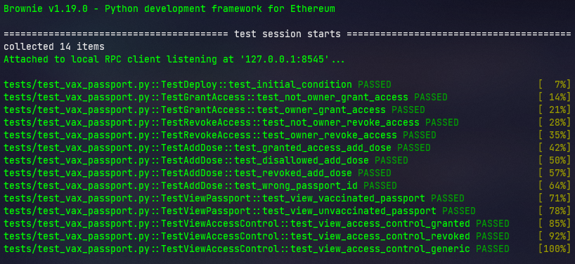

# Vaccination Passport Smart Contract


### Contract Rules

- Some global institution is able to __deploy__ the contract;
- People have __vaccination passports__ linked to their real world __IDs__;
- Contract owner is able to give countries' local health institutions __write access__;
- Institutions with __write access__ are able to add vaccine doses to passports;


### Local Installation

Install `eth-brownie` (tested with Python 3.8.13) and `ganache-cli` (tested with Node 16.15.0).

```shell
$ pip install eth-brownie
$ npm install -g ganache-cli
```


### Testing

Run tests

```shell
$ brownie test  -v --no-header
```
If you have success, you should see something like this:




Obs: note that it takes time for the tests to run because it automatically starts 
__ganache server__. It should be of no problem if you start it yourself on 
another terminal and keep it running whilst you're developing. 

Start ganache development server. Manually deploying like this makes it easier 
to run tests:

```shell
$ ganache-cli --port 8545 --gasLimit 12000000 --accounts 10 --hardfork istanbul --mnemonic brownie
```
